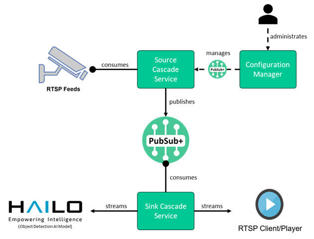

# Overview 

This folder consists of 2 modules / components:
1. Streaming RTSP over Solace PubSub+
2. Object Detection (using pre-trained AI models) on RTSP Stream via Solace Video Cascade Solution



# Part 1: Streaming RTSP over Solace PubSub+ 

### 1. Start RTSP Server / Source

Refer to [mediamtx](https://github.com/hafio/solace-psg/tree/main/mediamtx) folder to start a RTSP Feed (source from webcam and/or video file)

### 2. Start Solace PubSub+ and Video Gateway Cascades

Use the `docker-compose.yaml` file to spin up:
1. Solace PubSub+ Software (Containerized) Broker - Standard Single Node
2. Solace Video Gateway Solution Source Cascade
3. Solace Video Gateway Solution Sink Cascade

# Part 2: AI Processing on RTSP Stream via Solace PubSub+

There are various options to perform object detection on RTSP stream:

## Option 2A: Using GStreamer + Hailo Models + Raspberry Pi

Refer to [Solace AI Accelerator Video Detection](https://github.com/acagnetti/solace-ai-accelerator-video-detection). Additional links to read/watch/refer:
- https://www.youtube.com/watch?v=Z6aYwU8xnsA
- https://www.raspberrypi.com/documentation/computers/ai.html
- https://www.raspberrypi.com/documentation/accessories/m2-hat-plus.html#m2-hat-plus
- https://github.com/hailo-ai/hailo-rpi5-examples
- https://github.com/SolaceSamples/solace-samples-python

Install `hailo-rpi5-examples` as per above link (install/run setup) - refer to github for installation instructions.

Install `solace-samples-python` as per above link (install/run setup) - refer to github for installation instructions.

Put `detection_rtsp.py` (from [Solace AI Accelerator Video Detection](https://github.com/acagnetti/solace-ai-accelerator-video-detection)) into `hailo-rpi5-examples/basic_pipelines`, update Solace Broker and RTSP configuration details.

Execute:
```bash
cd hailo-rp15-examples
source setup_env.sh
cd basic_pipelines
python detection_rtsp.py
```
> all files above are in the corresponding repositories. The code in `detection_rtsp.py` is not fine-tuned or tweak and simply a MVP/POC.

## Option 2B: Using DeGirum

Refer to [DeGirum Hailo Examples](https://github.com/DeGirum/hailo_examples) and [Object Detection on RTSP Stream](https://community.hailo.ai/t/object-detection-on-an-rtsp-stream/8232).
- https://github.com/SolaceSamples/solace-samples-python
- https://hub.degirum.com/models/manage (DeGirum AI Hub Model Zoo)

1. Execute `git clone https://github.com/DeGirum/hailo_examples`
2. Install DeGirum as per above github instructions
2. Download `rtsp.py` from this folder
3. Update configurations of `rtsp.py` 
   - Download other models from DeGirum AI Hub (optional)
4. Execute `python rtsp.py`
> `python rtsp.py --help|-h|?` brings up the help menu and available (downloaded) pre-trained models

## Option 2C: Using 

# Other References

- https://github.com/hailo-ai/Hailo-Application-Code-Examples
